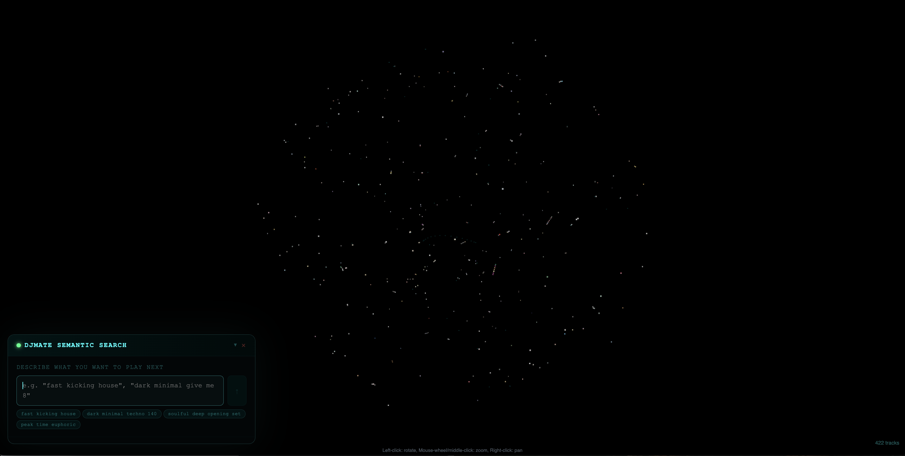
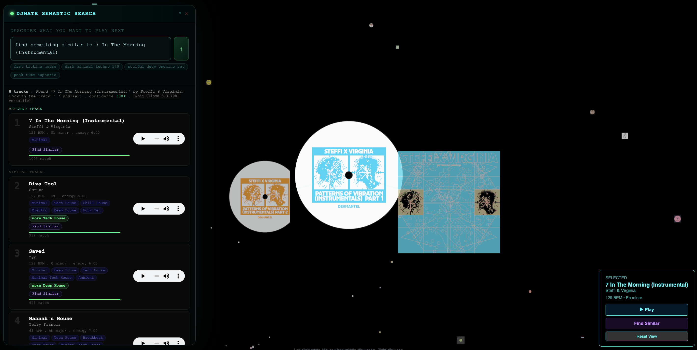
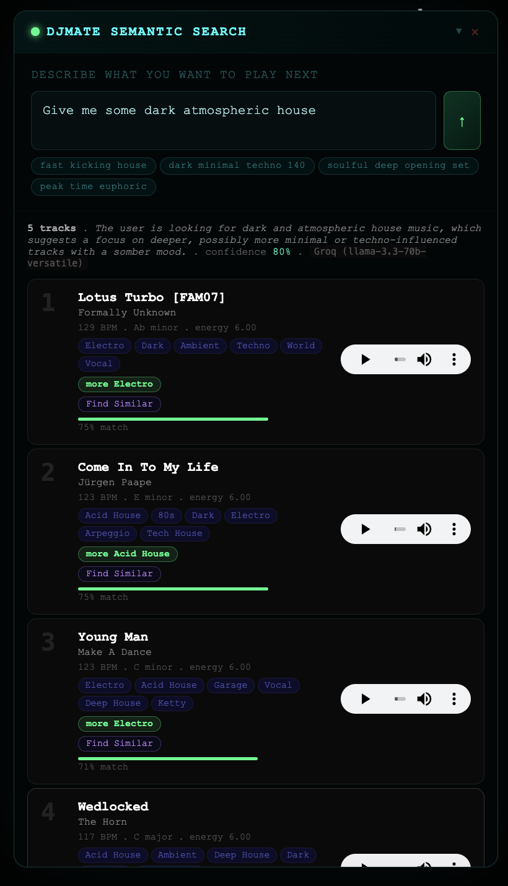
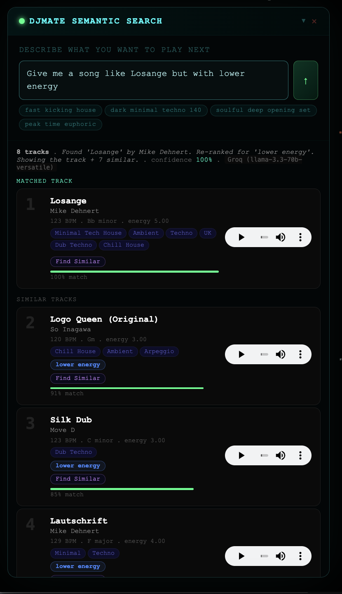
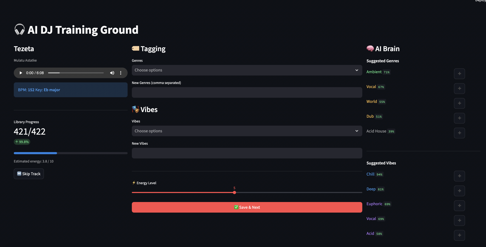

# DJMate — AI-Powered DJ Music Curation


A full-stack AI music curation system that lets DJs explore, search, and discover tracks from their personal library using natural language, audio embeddings, and semantic tagging — all visualised in an interactive 3D space.

> A new way to curate DJ sets.

---

## Screenshots
>Overview of the dashboard 3
Overview of the dashboard 4

>Overview of the dashboard2 
Overview of the dashboard 1 





---

## What it does

Type a natural language query into the floating chat panel and DJMate routes it through an LLM intent classifier before searching your library:

| Query | Intent | What happens |
|---|---|---|
| `"find me tracks like Newt Licker"` | `find_similar_track` | Fuzzy DB match → embedding similarity search |
| `"dark hypnotic techno"` | `vibe_genre_search` | LLM tag scoring → progressive relaxation search |
| `"take it higher"` | `transition_from_current` | Tag scoring relative to currently selected track |

Results appear ranked with similarity bars, BPM/key metadata, and audio preview — all cross-linked to the 3D graph.

---

## Architecture

```
┌─────────────────────────────────────────────────────────────┐
│                        React Frontend                        │
│   Three.js 3D graph  ·  DJChatbox  ·  Tagger (Streamlit)   │
└───────────────────────────┬─────────────────────────────────┘
                            │ HTTP (FastAPI)
┌───────────────────────────▼─────────────────────────────────┐
│                      FastAPI Backend                         │
│                                                              │
│  /chat/interpret  →  SemanticInterpreter                     │
│    1. Intent classifier  (Groq LLM)                          │
│    2. Route: fuzzy search | tag scoring | transition         │
│                                                              │
│  /chat/search     →  chat_router                             │
│    find_similar   →  pgvector embedding similarity           │
│    vibe/genre     →  progressive tag relaxation ladder       │
│    transition     →  tag scoring + current track context     │
│                                                              │
│  /tracks/{id}/audio  →  FileResponse stream                  │
└───────────────────────────┬─────────────────────────────────┘
                            │
┌───────────────────────────▼─────────────────────────────────┐
│                 Supabase (Postgres + pgvector)               │
│                                                              │
│  tracks       — metadata, filepath, 1280-dim embedding       │
│  track_labels — semantic_tags, vibe, energy (1–10)           │
│                 tag_source: manual | auto | auto_reviewed    │
└─────────────────────────────────────────────────────────────┘
```

### LLM Fallback Chain
Groq (llama-3.3-70b) → Gemini → OpenAI → Mistral

---

## Key Features

### 🧠 Natural Language Search
- **Intent routing**: LLM classifies every query into one of three intents before searching
- **Fuzzy track matching**: finds tracks even with typos, partial names, or artist-only queries
- **Canonical tag injection**: LLM prompt includes the full tag vocabulary so it never hallucinates tags
- **Energy as inference**: energy level is always inferred from context, never a required input

### 🌐 3D Music Space
- Every track in your library rendered as a node in 3D space
- Positions computed via UMAP dimensionality reduction on 1280-dim audio embeddings
- Click any track to fly the camera to it and see similarity edges to neighbours
- Album artwork as node textures

### 🏷️ Semantic Tagging System
- **Tagger.py** — Streamlit UI for manual track tagging with ML-powered AI suggestions
- **auto_tagger.py** — Batch script that tags untagged tracks using embedding-weighted neighbour aggregation
- **tag_source** column tracks provenance: `manual` → `auto` → `auto_reviewed`
- Auto-tagger only uses manually verified tracks as signal source (no cascade errors)

### 🎵 Audio Playback
- In-browser audio preview streamed directly from local files via FastAPI `FileResponse`
- Plays within search results without leaving the interface

---

## Database Schema

```sql
-- Core track table
CREATE TABLE tracks (
    trackid     SERIAL PRIMARY KEY,
    filepath    TEXT NOT NULL,
    title       TEXT,
    artist      TEXT,
    album       TEXT,
    bpm         FLOAT,
    key         TEXT,
    embedding   VECTOR(1280),   -- Audio embeddings
    x_coord     FLOAT,          -- Pre-computed UMAP 3D position
    y_coord     FLOAT,
    z_coord     FLOAT
);

-- Semantic labels (mutable, versioned by tag_source)
CREATE TABLE track_labels (
    trackid       INTEGER REFERENCES tracks(trackid),
    semantic_tags JSONB,        -- e.g. ["Techno", "Acid House", "UK"]
    energy        INTEGER,      -- 1-10 scale
    vibe          JSONB,        -- e.g. ["Dark", "Hypnotic", "Driving"]
    tag_source    TEXT          -- 'manual' | 'auto' | 'auto_reviewed'
);
```

---

## Project Structure

```
DJMate/
├── main.py                          # FastAPI app entry point
├── backend/
│   ├── llm_interpreter.py           # Intent classifier + tag scorer
│   ├── chat_router.py               # /chat/* FastAPI router
│   ├── Tagger.py                    # Streamlit manual tagging UI
│   ├── auto_tagger.py               # Batch ML auto-tagger
│   ├── reccomender.py               # Recommendation engine
│   └── data/
│       └── db_interface.py          # DatabaseManager (asyncpg + Supabase)
├── scripts/
│   ├── 3d_coordinator.py            # UMAP projection script
│   ├── repath_tracks.py             # Filepath repair utility
│   └── upload_album_covers.py       # Album art uploader
└── Frontend/
    └── src/components/
        └── DJChatbox.jsx            # Floating semantic search panel
```

---

## Quick Start

### Prerequisites
- Python 3.12+
- Node.js 18+
- A Supabase project with pgvector enabled
- Groq API key (free tier works fine)

### Backend

```bash
git clone https://github.com/yourusername/djmate.git
cd djmate

python -m venv .venv
source .venv/bin/activate
pip install -r requirements.txt

cp .env.example .env
# Fill in SUPABASE_URL, SUPABASE_KEY, GROQ_API_KEY

uvicorn main:app --reload --host 0.0.0.0 --port 8000
```

### Frontend

```bash
cd Frontend
npm install
npm run dev
```

### Tagging UI

```bash
streamlit run backend/Tagger.py
```

### Auto-tag your library

```bash
# Preview first
python backend/auto_tagger.py --dry-run

# Run
python backend/auto_tagger.py --min-sim 0.70
```

### Repath tracks after moving files

```bash
python scripts/repath_tracks.py --root "/path/to/your/music" --dry-run
python scripts/repath_tracks.py --root "/path/to/your/music"
```

---

## Environment Variables

```env
SUPABASE_URL=https://your-project.supabase.co
SUPABASE_KEY=your-anon-key
GROQ_API_KEY=your-groq-key
GEMINI_API_KEY=your-gemini-key      # optional fallback
OPENAI_API_KEY=your-openai-key      # optional fallback
MISTRAL_API_KEY=your-mistral-key    # optional fallback
```

---

## How the search pipeline works

```
User query
    │
    ▼
Intent classifier (LLM)
    │
    ├─── find_similar_track ──► fuzzy title/artist DB search
    │                               │
    │                               ▼
    │                          pgvector embedding similarity
    │                          Returns: matched track + similar tracks
    │
    ├─── vibe_genre_search ───► LLM tag scoring against canonical list
    │                               │
    │                               ▼
    │                          Progressive relaxation ladder
    │                          (exact tags → partial → inferred by embedding)
    │
    └─── transition_from_current ► same as vibe search
                                    weighted against current track context
```

---

## Technical Notes

- **Embeddings**: 1280-dimensional vectors computed from raw audio, stored in Supabase with pgvector. Similarity search via `match_tracks` RPC using cosine distance.
- **Auto-tagger**: For each untagged track, finds top-10 nearest neighbours by embedding cosine similarity, aggregates their tags/vibes/energy weighted by similarity score. Only uses `manual` or `auto_reviewed` tracks as signal to prevent cascade errors.
- **Progressive relaxation**: If a tag query returns fewer than the requested number of results, the search automatically widens — dropping low-weight tags first, then vibes, then inferring from embedding similarity alone.
- **UMAP projection**: Run offline via `3d Coordinator.py`, coordinates stored in the DB. The frontend reads pre-computed x/y/z — no runtime dimensionality reduction.

---

## License

MIT — see [LICENSE](LICENSE)

---

*Built for DJs who care about musical coherence, flow, and intent.*
